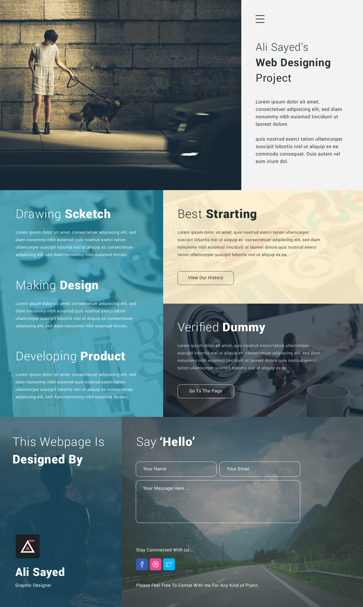

   <h1>Grid_project</h1>

<h3 align="center">👋🏼 Приветсвую!</h3>

### 📜 Описание  
Grid_project - это результат моего знакомства с Grid CSS.  
Проект был разработан по макету и адаптирован под разные устройства.

### 📸 Просмотр 
Проект Вы можете посмотреть на GitHub Page:  
https://olhaklymas.github.io/grid_project/

### ✏️ Макет

Макет можно скачать по ссылке  
https://www.dropbox.com/sh/pf7piuixn1zzg3c/AADDyRejHKplzV-EzGOmxtVxa?dl=0

    

